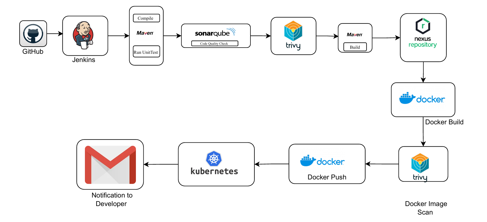
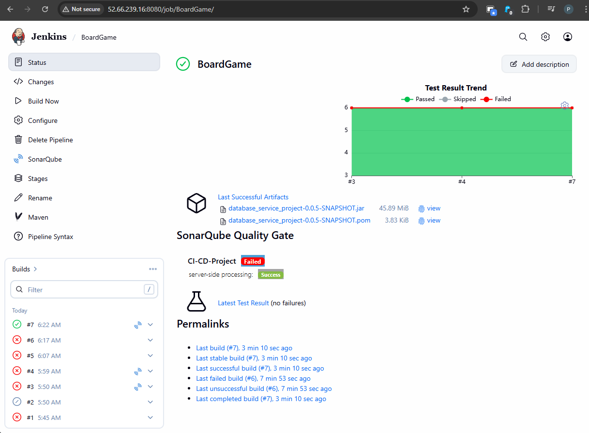
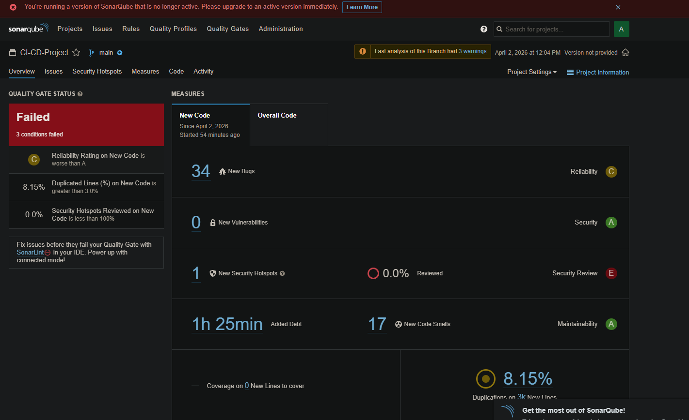
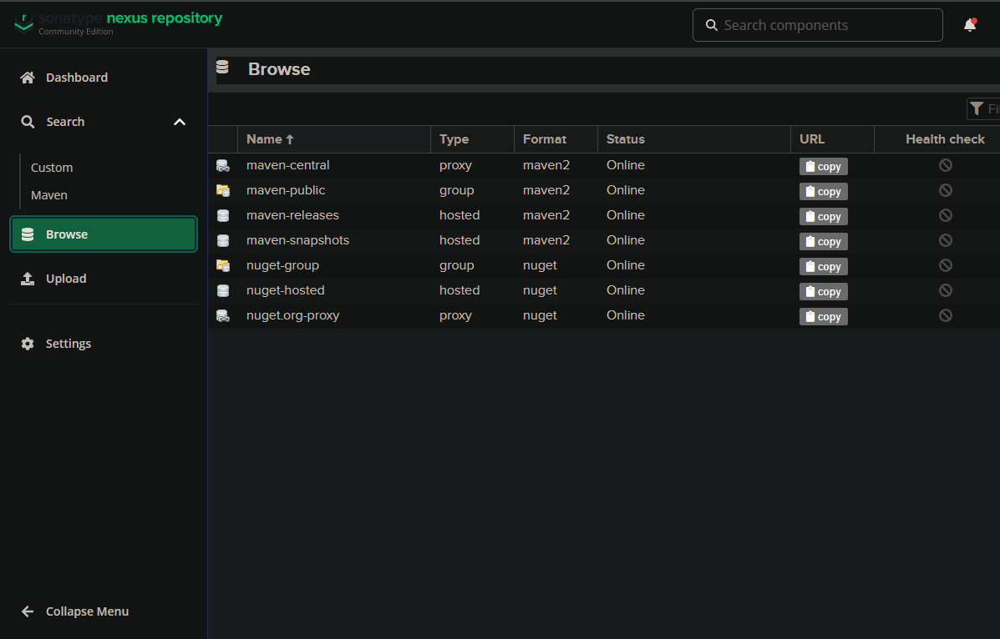
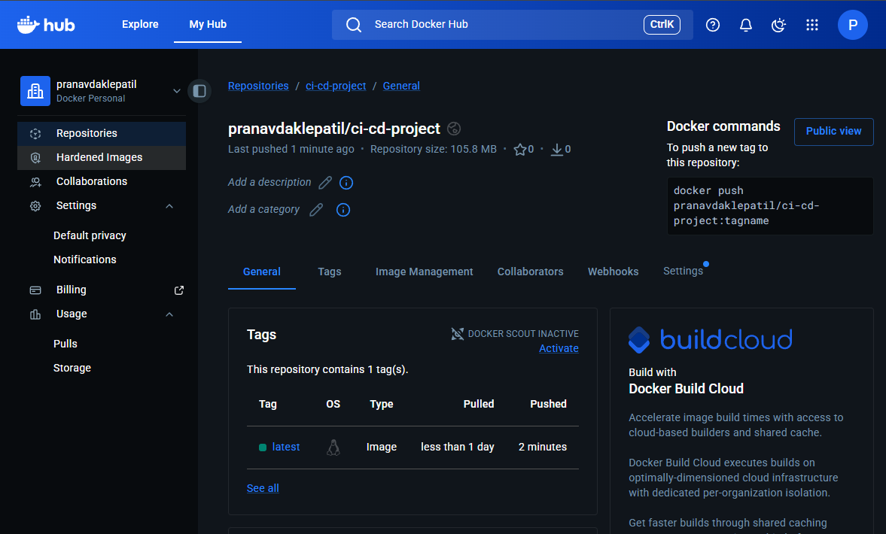
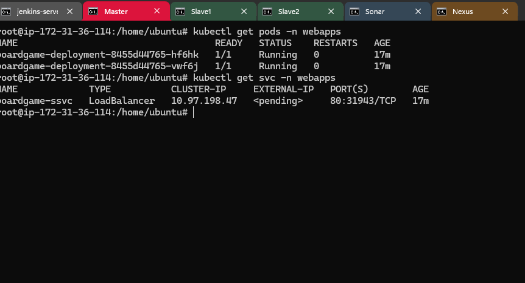
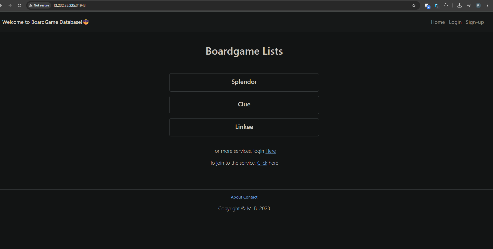

<div align="center">

```
   ██████╗ ██╗  ██████╗ ██████╗      ██████╗  ██╗ ██████╗  ███████╗ ██╗      ██╗ ███╗   ██╗ ███████╗
  ██╔════╝ ██║ ██╔════╝ ██╔══██╗     ██╔══██╗ ██║ ██╔══██╗ ██╔════╝ ██║      ██║ ████╗  ██║ ██╔════╝
██║      ██║ ██║      ██║  ██║     ██████╔╝ ██║ ██████╔╝ █████╗   ██║      ██║ ██╔██╗ ██║ █████╗
██║      ██║ ██║      ██║  ██║     ██╔═══╝  ██║ ██╔═══╝  ██╔══╝   ██║      ██║ ██║ ╚████║ ██╔══╝
  ╚██████╗ ██║ ╚██████╗ ██████╔╝     ██║      ██║ ██║      ███████╗ ███████╗ ██║ ██║  ╚███║ ███████╗
   ╚═════╝ ╚═╝  ╚═════╝ ╚═════╝      ╚═╝      ╚═╝ ╚═╝      ╚══════╝ ╚══════╝ ╚═╝ ╚═╝   ╚══╝ ╚══════╝
```

# Board Game Database — CI/CD Pipeline

**Production-grade, fully automated DevOps pipeline**
*From commit to production — with security gates at every stage*

<br/>

[](https://www.jenkins.io/doc/)
[](https://trivy.dev/)
[](https://docs.sonarsource.com/sonarqube/latest/)
[](https://kubernetes.io/docs/home/)
[](https://openjdk.org/projects/jdk/17/)
 
</div>
 
---
 
## 📖 Overview
 
This repository documents the complete **CI/CD pipeline** built for the **Board Game Database** — a full-stack web application for browsing board games and reviews with role-based access control.
 
The pipeline was designed with a single principle: **nothing untested, unscanned, or low-quality reaches production.** Every stage is a gate. Every gate has teeth.
 
```
GitHub Push → Jenkins → Maven Build → SonarQube → Trivy (FS)
    → Nexus Artifact → Docker Build → Trivy (Image) → Registry → Kubernetes → Email
```
 
---
 
## 📌 Table of Contents
 
- [Pipeline Architecture](#-pipeline-architecture)
- [Tools & Technologies](#-tools--technologies)
- [Pipeline Stages](#-pipeline-stages)
- [Security Strategy](#-security-scanning-strategy)
- [Screenshots](#-screenshots)
- [Notifications](#-notifications)
- [Prerequisites](#-prerequisites)
 
---
 
## 🏗️ Pipeline Architecture
 
<p align="center">
  
</p>
 
<p align="center">
  <sub>
    End-to-end CI/CD pipeline —
    <b>GitHub</b> → <b>Jenkins</b> → <b>Maven</b> → <b>SonarQube</b> → <b>Trivy</b> → <b>Nexus</b> → <b>Docker</b> → <b>Kubernetes</b> → <b>Email</b>
  </sub>
</p>
 
---
 
## 🛠️ Tools & Technologies
 
<div align="center">
 
| Tool | Category | Role in Pipeline |
|------|----------|-----------------|
| [](https://docs.github.com/) **GitHub** | Source Control | Hosts source code; triggers Jenkins via webhook on every push |
| [](https://www.jenkins.io/doc/) **Jenkins** | CI/CD Orchestration | Automates and orchestrates the entire pipeline end-to-end |
| [](https://maven.apache.org/guides/) **Maven** | Build & Test | Compiles source, runs unit tests, packages the `.jar` artifact |
| [](https://docs.sonarsource.com/sonarqube/latest/) **SonarQube** | Code Quality | Static analysis — detects bugs, vulnerabilities, and code smells |
| [](https://trivy.dev/latest/docs/) **Trivy** | Security Scanning | Dual-phase CVE scanning — filesystem and Docker image |
| [](https://help.sonatype.com/en/sonatype-nexus-repository.html) **Nexus** | Artifact Registry | Stores and versions all built `.jar` artifacts |
| [](https://docs.docker.com/) **Docker** | Containerization | Packages the application into a portable container image |
| [](https://kubernetes.io/docs/home/) **Kubernetes** | Orchestration | Deploys, scales, and manages containers in production |
| [](https://support.google.com/mail/answer/7126229) **Gmail SMTP** | Notifications | Sends pipeline success/failure alerts automatically |
 
</div>
 
---
 
## 📋 Pipeline Stages
 
> The pipeline is designed with **security and quality gates at every stage** — only clean, tested, and vulnerability-free code reaches production.
 
---
 
### `Stage 1` — 🔀 Source Code Trigger
 
**GitHub → Jenkins via Webhook**
 
- A webhook on the GitHub repository notifies Jenkins on every `push` or `pull request merge`
- Jenkins picks up the event and kicks off the full pipeline — **zero manual intervention**
- No commit goes unprocessed; every change is traced through to deployment
 
---
 
### `Stage 2` — ⚙️ Compile & Unit Test
 
**Tool: [Maven](https://maven.apache.org/guides/introduction/introduction-to-the-lifecycle.html)**
 
```bash
mvn clean compile
mvn test
```
 
- Maven resolves all dependencies and compiles the Java source
- Unit tests run automatically — pipeline **halts immediately on test failure**
- Broken code never proceeds to downstream stages
 
---
 
### `Stage 3` — 🔍 Code Quality Gate
 
**Tool: [SonarQube](https://docs.sonarsource.com/sonarqube/latest/analyzing-source-code/overview/)**
 
```bash
mvn sonar:sonar \
  -Dsonar.projectKey=board-game-db \
  -Dsonar.host.url=http://<sonarqube-host>:9000 \
  -Dsonar.login=<token>
```
 
- Deep static analysis across the entire codebase
- Checks for **bugs, security hotspots, code smells, duplications, and test coverage**
- A **Quality Gate** is enforced — the pipeline fails if the gate is not passed
- Results are published to the SonarQube dashboard for review
 
---
 
### `Stage 4` — 🛡️ Filesystem Vulnerability Scan *(Trivy — Pass 1 of 2)*
 
**Tool: [Trivy](https://trivy.dev/latest/docs/target/filesystem/)**
 
```bash
trivy fs --exit-code 1 --severity HIGH,CRITICAL .
```
 
- Scans source files, `pom.xml` dependencies, and the filesystem for known CVEs **before packaging**
- Pipeline **fails on HIGH and CRITICAL** severity findings
- Catches dependency-level vulnerabilities early — before a Docker image is even built
 
---
 
### `Stage 5` — 📦 Build & Publish Artifact
 
**Tool: [Maven](https://maven.apache.org/plugins/maven-deploy-plugin/) → [Nexus](https://help.sonatype.com/en/sonatype-nexus-repository.html)**
 
```bash
mvn clean package -DskipTests
mvn deploy
```
 
- Maven packages the application into a deployable `.jar`
- Artifact is **uploaded and versioned in Nexus Repository Manager**
- Nexus is the single source of truth for all build artifacts
 
---
 
### `Stage 6` — 🐳 Docker Image Build
 
**Tool: [Docker](https://docs.docker.com/reference/cli/docker/buildx/build/)**
 
```bash
docker build -t board-game-db:${BUILD_NUMBER} .
docker tag board-game-db:${BUILD_NUMBER} <registry>/board-game-db:latest
```
 
- Docker builds a container image from the `Dockerfile` in the repository
- Image is tagged with the **Jenkins build number** for full traceability
 
---
 
### `Stage 7` — 🔒 Docker Image Vulnerability Scan *(Trivy — Pass 2 of 2)*
 
**Tool: [Trivy](https://trivy.dev/latest/docs/target/container_image/)**
 
```bash
trivy image --exit-code 1 --severity HIGH,CRITICAL <registry>/board-game-db:latest
```
 
- Trivy performs a second scan — this time against the **built Docker image**
- Catches OS-level packages, base image vulnerabilities, and installed library CVEs
- Together with Stage 4, this forms a **defense-in-depth** security model
 
---
 
### `Stage 8` — 📤 Push to Container Registry
 
**Tool: [Docker Hub](https://docs.docker.com/docker-hub/)**
 
```bash
docker push <registry>/board-game-db:latest
docker push <registry>/board-game-db:${BUILD_NUMBER}
```
 
- Only images that passed **all prior quality and security gates** reach this stage
- Both `latest` and build-numbered tags are pushed for traceability and rollback
 
---
 
### `Stage 9` — ☸️ Kubernetes Deployment
 
**Tool: [kubectl](https://kubernetes.io/docs/reference/kubectl/)**
 
```bash
kubectl apply -f deployment-service.yaml
kubectl rollout status deployment/board-game-db
```
 
- Kubernetes performs a **rolling deployment** — zero downtime
- Deployment health is verified before the stage is marked successful
- Failed rollouts automatically trigger pipeline failure and notification
 
---
 
### `Stage 10` — 📧 Developer Notification
 
**Tool: [Jenkins](https://plugins.jenkins.io/email-ext/) + Gmail SMTP**
 
- An automated email is sent at the **end of every pipeline run**, regardless of outcome
- Notification includes: build status, build number, failed stage (if any), and a direct link to console output
 
---
 
## 🔒 Security Scanning Strategy
 
> Two Trivy scans are **intentionally placed at different stages** to provide layered security coverage.
 
<div align="center">
 
| Scan | Tool | Stage | What It Catches |
|------|------|-------|----------------|
| **Filesystem Scan** | [Trivy](https://trivy.dev/) | After SonarQube | Source code CVEs, `pom.xml` dependency vulnerabilities |
| **Docker Image Scan** | [Trivy](https://trivy.dev/) | After Docker Build | OS packages, base image layers, installed library CVEs |
| **Static Code Analysis** | [SonarQube](https://docs.sonarsource.com/sonarqube/latest/) | After Unit Tests | Bugs, security hotspots, code smells, coverage gaps |
 
</div>
 
**Why two Trivy scans?**  
The filesystem scan catches vulnerable dependencies *before* the image is built — cheap and fast.
The image scan catches OS-level vulnerabilities introduced by the base image itself — a completely different attack surface. Running both means there is no gap between what's in the code and what ends up in production.
 
---
 
## 📸 Screenshots
 
### ✅ Jenkins Pipeline — Success
 
<p align="center">
  
</p>
 
---
 
### 🔍 SonarQube Code Analysis
 
<p align="center">
  
</p>
 
---
 
### 📦 Nexus Artifact Repository
 
<p align="center">
  
</p>
 
---
 
### 🐳 Docker Hub — Image Pushed
 
<p align="center">
  
</p>
 
---
 
### ☸️ Kubernetes Deployment
 
<p align="center">
  
</p>
 
---
 
### 🌐 Application Running
 
<p align="center">
  
</p>
 
---
 
## 📧 Notifications
 
<div align="center">
 
| Event | Trigger | Content |
|-------|---------|---------|
| ✅ **Pipeline Success** | On successful deployment | Build number, deployment confirmation |
| ❌ **Pipeline Failure** | On any stage failure | Failed stage name, console log link |
| ⚠️ **Quality Gate Breach** | SonarQube gate not passed | Gate name, analysis dashboard link |
| 🔒 **Vulnerability Detected** | Trivy scan finds HIGH/CRITICAL | Scan type (FS/Image), severity level |
 
</div>
 
---
 
## ✅ Prerequisites
 
<div align="center">
 
| Component | Requirement |
|-----------|-------------|
| **[Jenkins](https://www.jenkins.io/doc/book/installing/)** | v2.400+ · Plugins: Maven Integration, Docker Pipeline, SonarQube Scanner, Kubernetes CLI, Email Extension |
| **[SonarQube](https://docs.sonarsource.com/sonarqube/latest/setup-and-upgrade/install-the-server/introduction/)** | v9.x+ server running · API token configured in Jenkins credentials |
| **[Trivy](https://trivy.dev/latest/getting-started/installation/)** | Binary installed on Jenkins agent · Available in `$PATH` |
| **[Nexus Repository](https://help.sonatype.com/en/installation-and-upgrades.html)** | Running instance · Maven hosted repository configured |
| **[Docker](https://docs.docker.com/engine/install/)** | Installed on Jenkins agent · Docker Hub credentials stored in Jenkins |
| **[Kubernetes](https://kubernetes.io/docs/setup/)** | Cluster accessible from Jenkins · `kubectl` configured with valid kubeconfig |
| **[Java](https://openjdk.org/install/)** | JDK 17+ |
| **[Maven](https://maven.apache.org/install.html)** | 3.8+ |
| **SMTP** | [Gmail SMTP](https://support.google.com/mail/answer/7126229) configured in Jenkins system settings |
 
</div>
 
---
 
## Reference
 
> 👤 Original Project: [Aditya Jaiswal](https://github.com/jaiswaladi246)  
> 🔗 Reference Repository: [github.com/jaiswaladi246/Boardgame](https://github.com/jaiswaladi246/Boardgame)
 
---
 
<div align="center">
 
**Built & maintained by [Pranav Dakle Patil](https://github.com/PranavDaklePatil)**
 
*Automated from commit to production — every stage a gate, every gate a guarantee.*
 
<br/>
 


 
</div>